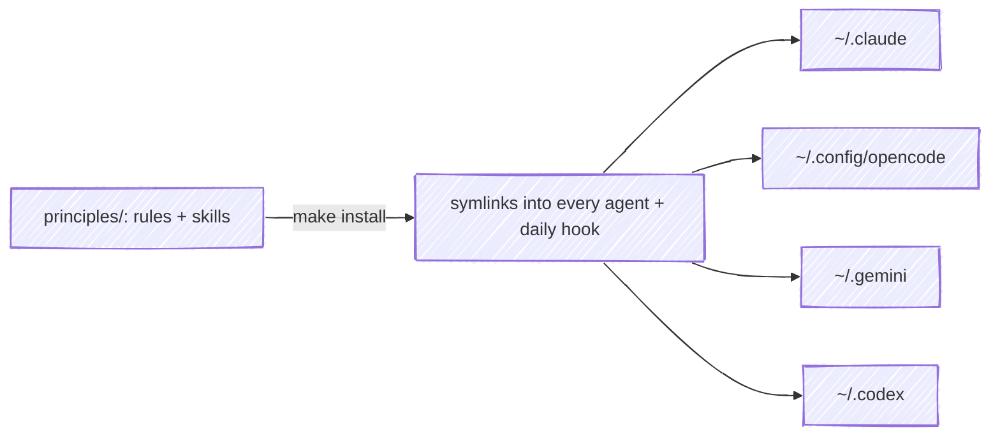
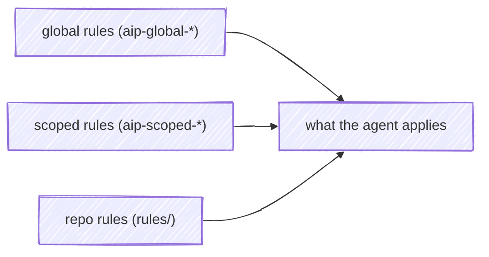

# ai-principles

> ⚡ Models change. Agents come and go. The principles stay. In a world moving at the speed of light, build on what you truly care about. It is the only thing that anchors us.

This is where I ([Rebeca](https://github.com/rebecamendez)) keep my principles for every AI agent, to use and review them in all my projects. Edit once, install everywhere. `ai-principles` is a single source of truth for the rules and skills you want **every** AI agent to follow: Claude Code, opencode, Gemini, Codex... Instead of copy-pasting the same instructions into each tool by hand, you maintain them in one place and push them out with a single command.

An alternative, personal version of the approach I lead at work, where I share our team's coding standards with the collaboration and inspiration of teammates. Here I work with the free [opencode](https://opencode.ai) models, while at work we use paid models like Claude, so this is a simplified take, meant for personal and educational use. Inspired by [this article on encoding team standards](https://martinfowler.com/articles/reduce-friction-ai/encoding-team-standards.html) by Rahul Garg, published on [martinfowler.com](https://martinfowler.com).

## Quick start 🚀

```bash
make install    # link into agents + install daily hook
make doctor     # verify everything is in place
# later, if you change your mind:
make uninstall  # remove our links and the hook
```

## Why 💡

Keeping agents in sync by hand is boring and error-prone. `ai-principles` gives you:

- 📦 **One source of truth**: rules and skills live in `principles/`, nothing else matters.
- ⚡ **One command**: `make install` links everything into your local agents.
- 🔄 **Always up to date**: a tiny shell hook (`.bashrc`, `.zshrc`, or `.profile`) pulls and re-installs once a day.
- 🧹 **Safe to remove**: everything we install is symlinked back to this repo, so `make uninstall` only touches our links.

## What's inside 📦

- **Rules**: `aip-global-git`, `aip-global-documentation`, `aip-scoped-typescript`, `aip-scoped-bash` (full list in `principles/rules/index.md`).
- **Decision**: `aip-global-0001`, portable Markdown over per-agent native rules (`principles/adrs/index.md`).
- **Skill**: `audit-code-principles`, audits any codebase against these principles; `create-pr`, opens branch, commits, push, and pull request for you (`principles/skills/README.md`).
- **Command**: `/cmd-audit-code` and `/cmd-create-pr` (opencode) wrap the `audit-code-principles` and `create-pr` skills (`principles/commands/`).

## How it works ⚙️



`make install` never copies anything. It creates **symlinks**: each agent config dir points back to this repo, so there is a single copy of the truth (`principles/`). With Claude as the example:

```
~/.claude/
├── CLAUDE.md                            ──► principles/AGENTS.md
├── rules/
│   ├── index.md                         ──► principles/rules/index.md
│   ├── aip-global-git.md                ──► principles/rules/aip-global-git.md
│   ├── aip-global-documentation.md      ──► principles/rules/aip-global-documentation.md
│   ├── aip-scoped-bash.md               ──► principles/rules/aip-scoped-bash.md
│   └── aip-scoped-typescript.md         ──► principles/rules/aip-scoped-typescript.md
├── adrs/
│   └── index.md + template.md + aip-*.md   ──► principles/adrs/
└── skills/
    ├── audit-code-principles/         ──► principles/skills/audit-code-principles/
    └── create-pr/                     ──► principles/skills/create-pr/
```

Claude is just the example above. The same tree lands in every agent; only the entry file name and folder change:

| Agent       | Entry file  | Config dir            |
| ----------- | ----------- | --------------------- |
| Claude Code | `CLAUDE.md` | `~/.claude/`          |
| opencode    | `AGENTS.md` | `~/.config/opencode/` |
| Gemini CLI  | `GEMINI.md` | `~/.gemini/`          |
| Codex       | `AGENTS.md` | `~/.codex/`           |

All four get the same `rules/`, `adrs/`, and `skills/`; opencode also gets `commands/`. The list lives in `scripts/aip.sh` (the `TARGETS` array): add or remove agents there, then run `make install`.

### One format for everyone

The rules are plain Markdown. Claude Code, opencode, Gemini CLI, and Codex all read Markdown instruction files (`CLAUDE.md`, `AGENTS.md`, `GEMINI.md`), so the same content works for all four with zero conversion. There is nothing to transpile: write once, everyone reads it.

### Native or portable

The full decision and its trade-offs are recorded in [ADR aip-global-0001](principles/adrs/aip-global-0001-portable-markdown-over-native.md). In short:

- **Entry file**: native per agent (`CLAUDE.md`, `AGENTS.md`, `GEMINI.md`), the only native hook each tool has.
- **Rules and ADRs**: portable Markdown, loaded because the entry file points to them.
- **Skills**: near-native, `SKILL.md` with `name`/`description` frontmatter, recognized by Claude Code and opencode.

### How the agent finds the rules

1. The agent opens its entry file (`CLAUDE.md`, `AGENTS.md`, or `GEMINI.md`), which is a symlink to `principles/AGENTS.md`.
2. That file tells it: read `rules/index.md` first, then `rules/aip-global-*.md` (always) and `rules/aip-scoped-*.md` (only when the project matches the tech).
3. Those files sit right next to it in the config dir, also as symlinks to this repo.

Every agent follows the same three-step flow. There is no division of labor: the four tools do not split tasks between them. All four load the same principles and follow them while they work. The only difference is which tool reads the files.

Edit in `principles/`, run `make install` (or let the daily hook do it), and every agent sees the new version. Nothing to copy, nothing to keep in sync.

### Rules stack by scope

Each agent applies only what it needs:



- `aip-global-*.md`: apply everywhere, always.
- `aip-scoped-<tech>.md`: apply only when the project matches the tech.
- `repo rules`: the project's own rules folder, wins over the rest.

Every repo should carry its own `rules/` folder. This repo is an example:

```
rules/                    # repo-scoped rules, they win
├── index.md              # how repo rules work
└── repo-maintenance.md   # example: this repo's own rules
```

Same format as the principles, minus the `aip-` prefix: repo rules are not installed, so they don't need the uninstall marker. Read `rules/index.md` to see the full convention.

### A rule looks like this

Every rule bullet carries a readable id you can reference later:

```
- [MUST] make atomic commits: one responsibility per commit. { aip-global-git.atomic-commits }
```

## Commands ⌨️

| Command          | What it does                                                  |
| ---------------- | ------------------------------------------------------------- |
| `make install`   | links `principles/` into your agents, installs the daily hook |
| `make uninstall` | removes our links (rules/ADRs with `aip-`, skill symlinks) and the hook             |
| `make doctor`    | checks all links and the hook are present                     |
| `make lint`      | runs the local checks (syntax, em dashes, indexes)            |
| `make version`   | shows the current commit, date, and message                   |

## Layout 🗂️

```
.
├── rules/                 # this repo's own rules, they win
├── scripts/
│   ├── aip.sh              # the CLI behind make
│   └── lint.sh             # local checks (make lint)
├── principles/             # installable principles
│   ├── AGENTS.md          # the source of truth agents read
│   ├── adrs/              # decision records: index + template + aip-*
│   ├── rules/             # aip-global-* + aip-scoped-*
│   ├── skills/            # <name>/SKILL.md
│   └── commands/          # opencode cmd-*.md installed globally
└── .github/
    ├── workflows/pr-verify.yml
    └── pull_request_template.md
```

## Extending 🌱

- **Add a rule**: create `principles/rules/aip-<global|scoped>-<name>.md`, add it to `principles/rules/index.md`, run `make install`.
- **Add an ADR**: copy `principles/adrs/template.md` to `principles/adrs/aip-<global|scoped>-NNNN-<slug>.md`, add it to `principles/adrs/index.md`, run `make install`.
- **Add a skill**: create `principles/skills/<name>/SKILL.md`, run `make install`.
- **Use a skill**: skills turn on when the task matches their `description`, or you can ask the agent by name, e.g. "use audit-code-principles". The available skills are listed in `principles/skills/README.md`.
- **opencode commands in this repo**: `/cmd-audit-rules` runs the `audit-rules` skill, `/cmd-create-rule` runs the `create-rule` skill (they live in `.opencode/commands/`). Installable commands like `/cmd-create-pr` live in `principles/commands/` and land in `~/.config/opencode/commands/` with `make install`.

## Crafted with 🛠️

This repository was built with [opencode](https://opencode.ai) and the `opencode/big-pickle` model, putting the principles you see here into practice every step of the way.


