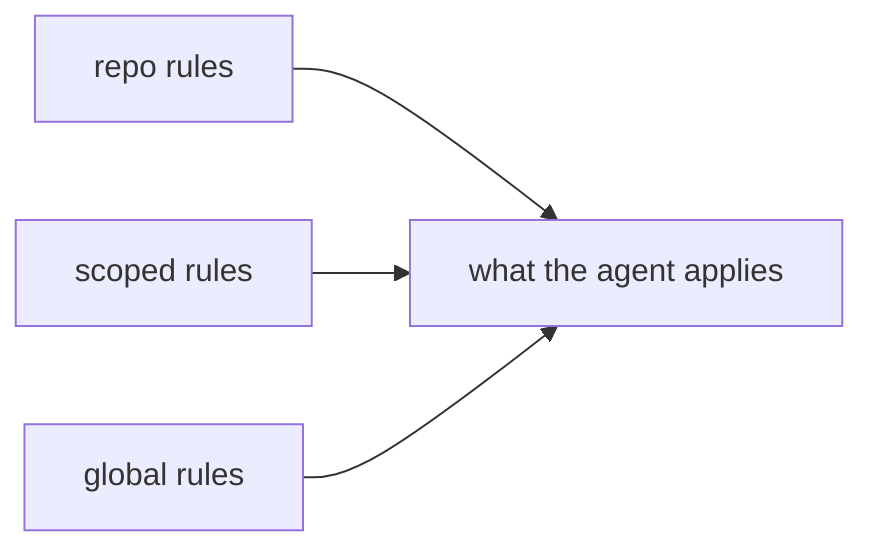

# Repo rules

This folder holds the rules that apply **only to this repo**. They win over everything in `principles/`.

```
rules/                    # your own rules, repo-scoped
principles/rules/          # installed by `make install`: global + scoped
```

## Precedence



## Format

Same format as the principles rules, but without the `aip-` prefix: these rules are not installed anywhere, so they don't need the uninstall marker.

- `[MUST]`: mandatory.
- `[SHOULD]`: recommended; skip it if you have a good reason.
- `[NICE]`: optional, nice to have.

Each bullet carries its readable id: `<file>.<rule>`, e.g. `{ my-repo-rule.some-rule }`.

## Rules

| Rule | Scope | What it covers |
|---|---|---|
| [repo-maintenance](repo-maintenance.md) | repo | keeping this repo tidy: install, language, indexes, lint, doctor |

## Add a repo rule

1. Create `rules/<file>.md` in this project, following `rules/repo-maintenance.md`.
2. Add a row to this index.
